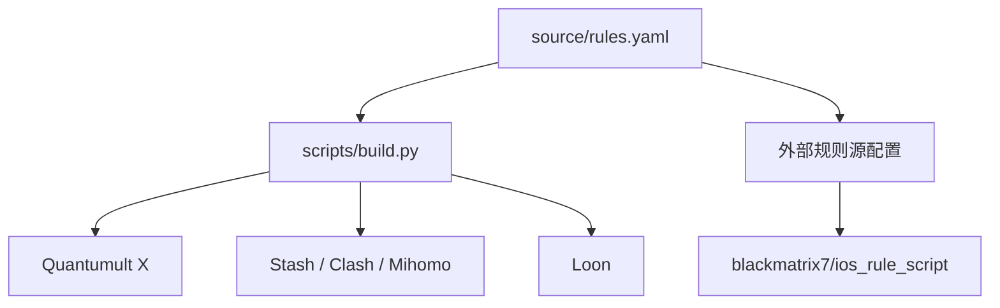

<div align="center">

# 🧭 Proxy Rules

**A personal rule center for Quantumult X, Stash / Clash / Mihomo, and Loon.**

一份源规则，自动生成三端规则；个人规则 + 开源规则源统一维护。

[](https://github.com/liueggy/proxy-rules/actions)
[](https://github.com/liueggy/proxy-rules/commits/main)
[](https://github.com/liueggy/proxy-rules)

</div>

---

## ✨ 特性

- 🧩 **三端兼容**：Quantumult X / Stash / Loon
- 🗂️ **统一源规则**：只维护 `source/rules.yaml`
- ⚙️ **自动生成**：`scripts/build.py` 一键生成三端规则
- 🤖 **GitHub Actions**：push 后自动构建、校验并提交生成文件
- 🔗 **外部规则源**：接入 `blackmatrix7/ios_rule_script`，避免重复维护
- 🛡️ **自有服务器直连**：ocean / Hermes / toy 固定 `DIRECT`

---

## 🚀 快速导入

> 如果只想直接使用，复制对应 Raw URL 到代理软件即可。

### Quantumult X

| 类型 | Raw URL |
|---|---|
| 总分流规则 | `https://raw.githubusercontent.com/liueggy/proxy-rules/main/quantumult-x/rules.list` |
| 外部规则片段 `[filter_remote]` | `https://raw.githubusercontent.com/liueggy/proxy-rules/main/quantumult-x/external-filter-remote.conf` |
| 重写模板 | `https://raw.githubusercontent.com/liueggy/proxy-rules/main/quantumult-x/rewrite.conf` |
| 任务模板 | `https://raw.githubusercontent.com/liueggy/proxy-rules/main/quantumult-x/task.conf` |
| 策略组模板 | `https://raw.githubusercontent.com/liueggy/proxy-rules/main/quantumult-x/policy-snippet.conf` |

### Stash / Clash / Mihomo

| 类型 | Raw URL |
|---|---|
| 个人 Override | `https://raw.githubusercontent.com/liueggy/proxy-rules/main/stash/override.yaml` |
| 外部规则 Override | `https://raw.githubusercontent.com/liueggy/proxy-rules/main/stash/external-providers.yaml` |
| 总规则集 | `https://raw.githubusercontent.com/liueggy/proxy-rules/main/stash/rules.yaml` |

### Loon

| 类型 | Raw URL |
|---|---|
| 总分流规则 | `https://raw.githubusercontent.com/liueggy/proxy-rules/main/loon/rules.list` |
| 外部规则片段 `[Remote Rule]` | `https://raw.githubusercontent.com/liueggy/proxy-rules/main/loon/external-remote-rules.conf` |
| 插件 | `https://raw.githubusercontent.com/liueggy/proxy-rules/main/loon/plugin.plugin` |
| 策略组模板 | `https://raw.githubusercontent.com/liueggy/proxy-rules/main/loon/policy-snippet.conf` |

---

## 🧱 规则架构



```text
.
├── source/rules.yaml           # 统一源规则：个人规则 + 外部规则源
├── scripts/
│   ├── build.py                # 生成 QX / Stash / Loon
│   └── check.py                # YAML / URL 校验
├── quantumult-x/               # Quantumult X 输出
├── stash/                      # Stash / Clash / Mihomo 输出
├── loon/                       # Loon 输出
├── docs/                       # 文档
└── .github/workflows/          # GitHub Actions 自动构建
```

---

## 🧭 策略组约定

| 策略组 | 用途 |
|---|---|
| `DIRECT` | 直连，包含国内服务和自有服务器 |
| `Proxy` | 默认代理 |
| `AI` | OpenAI / Claude / Gemini 等 AI 服务 |
| `Streaming` | YouTube / Netflix / Disney+ / Spotify |
| `Apple` | Apple / iCloud / CDN |
| `REJECT` | 广告拦截 / 隐私追踪拦截 |

> 使用外部规则片段前，请确保客户端里已经存在 `AI`、`Streaming`、`Apple` 等策略组。

---

## 🧩 分类规则

### AI

| 客户端 | Raw URL |
|---|---|
| QX | `https://raw.githubusercontent.com/liueggy/proxy-rules/main/quantumult-x/rules/ai.list` |
| Stash | `https://raw.githubusercontent.com/liueggy/proxy-rules/main/stash/rules/ai.yaml` |
| Loon | `https://raw.githubusercontent.com/liueggy/proxy-rules/main/loon/rules/ai.list` |

### 自有服务器直连

| 客户端 | Raw URL |
|---|---|
| QX | `https://raw.githubusercontent.com/liueggy/proxy-rules/main/quantumult-x/rules/direct-servers.list` |
| Stash | `https://raw.githubusercontent.com/liueggy/proxy-rules/main/stash/rules/direct-servers.yaml` |
| Loon | `https://raw.githubusercontent.com/liueggy/proxy-rules/main/loon/rules/direct-servers.list` |

当前直连服务器：

| 名称 | IP | 说明 |
|---|---:|---|
| ocean | `167.71.221.110` | ROS 中继 + chatgpt2api |
| Hermes | `168.144.136.246` | sub2api + MTProxy + Xray |
| toy | `167.71.214.73` | eggy-ros-relay + chatgpt2api |

---

## 🔗 外部规则源

当前接入：

| 来源 | 说明 |
|---|---|
| [`blackmatrix7/ios_rule_script`](https://github.com/blackmatrix7/ios_rule_script) | QX / Loon / Clash 多端规则源，分类完整 |

已接入分类：OpenAI、Claude、Gemini、GitHub、Telegram、YouTube、Netflix、Disney、Spotify、Apple、AdvertisingLite。

更多说明：

```text
https://raw.githubusercontent.com/liueggy/proxy-rules/main/docs/external-sources.md
```

---

## 🛠️ 维护方式

### 1. 修改统一源规则

```bash
source/rules.yaml
```

### 2. 本地生成

```bash
python3 scripts/build.py
```

### 3. 本地校验

```bash
python3 scripts/check.py
```

如需检查外部链接可用性：

```bash
python3 scripts/check.py --urls
```

### 4. 提交推送

```bash
git add -A
git commit -m "rules: update proxy rules"
git push
```

GitHub Actions 会在 push 后自动构建并提交生成文件。

---

## ⚠️ 注意事项

1. 外部规则源会随上游变化，如上游路径调整，远程导入可能失效。
2. 广告拦截规则不要过度叠加，可能导致 App 白屏、登录失败或验证码异常。
3. QX / Loon 使用远程规则时，请确认本地策略组名称存在。
4. Stash 推荐优先使用 Override 文件，便于统一管理 rule-providers 和规则顺序。

---

<div align="center">

Made with ❤️ for personal network routing.

</div>
